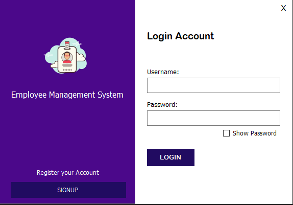
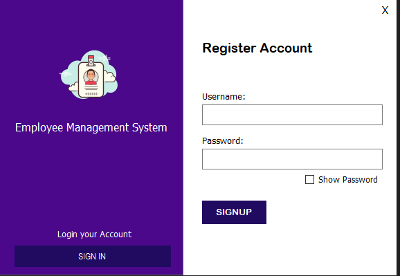
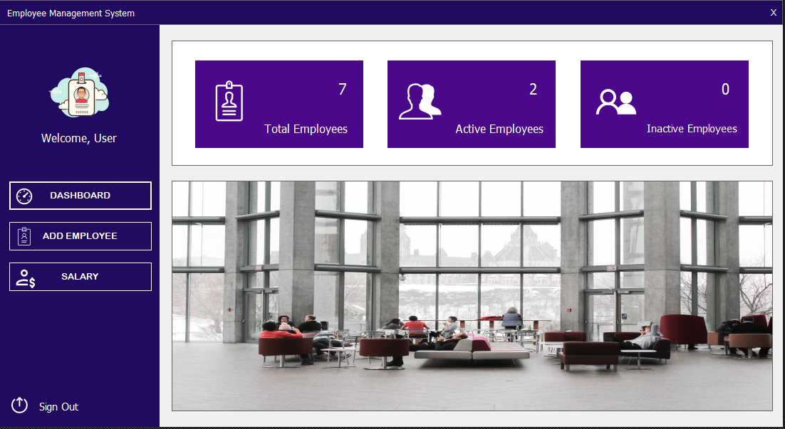
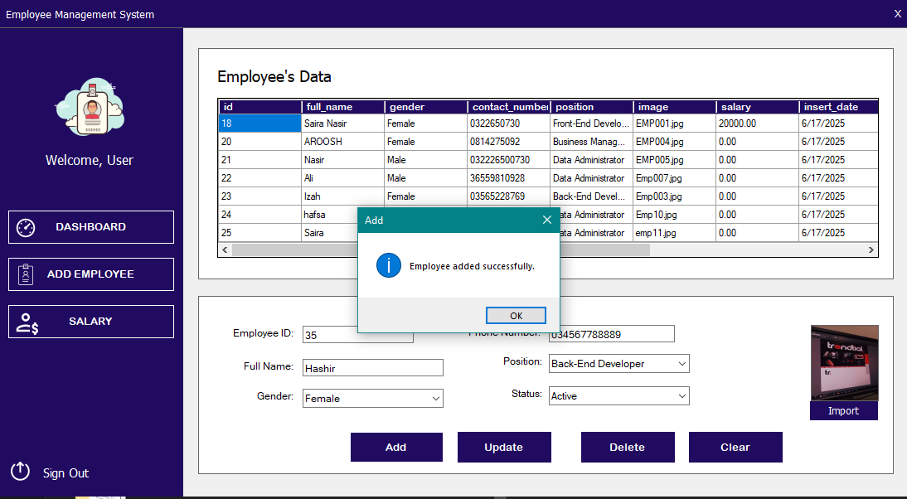
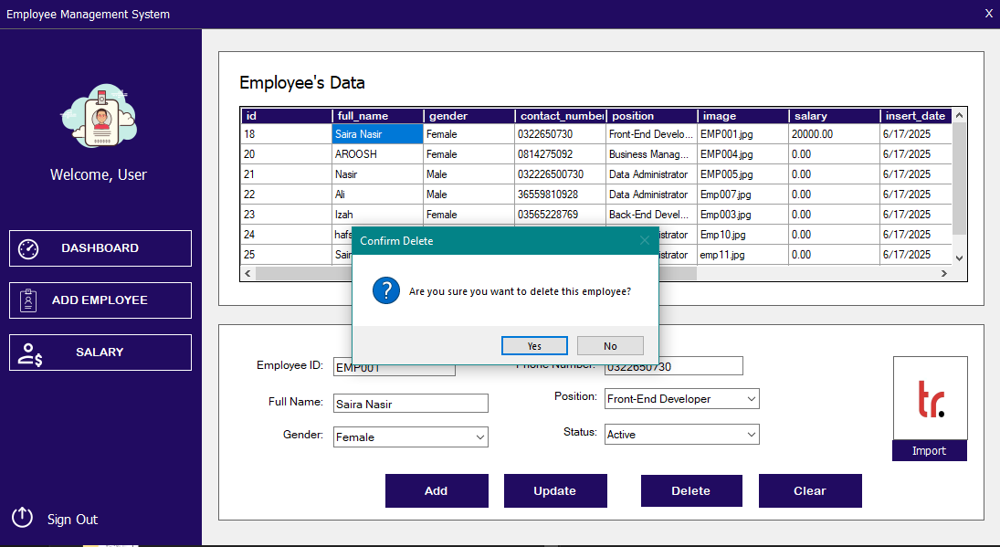
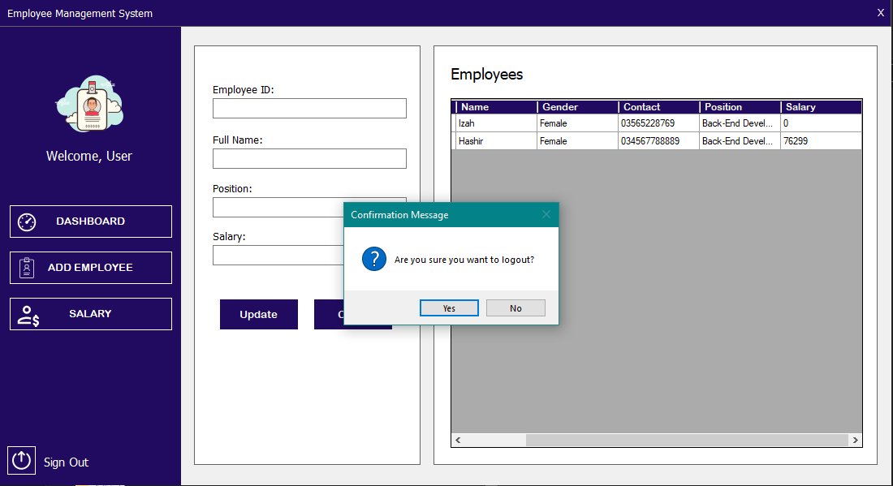

# 👨‍💼 Employee Management System – Windows Forms App


A modern **Employee Management System** developed using **C# Windows Forms** and **SQL Server**, fulfilling semester project requirements. It features secure login/signup, dynamic CRUD operations, salary management, and visual stats.

---

## 🚀 Features

- 🔐 User authentication (Login & Signup)
- 📋 Add, update, delete, and search employee records
- 💰 Salary check & update interface
- 📊 Live display of employee data in a table view
- 👥 User-friendly dashboard navigation
- 🧾 Logout confirmation prompt for security

---

## 🛠️ Tech Stack

| Layer      | Technology            |
|------------|------------------------|
| Frontend   | Windows Forms (.NET)   |
| Backend    | SQL Server             |
| IDE        | Visual Studio          |
| Language   | C#                     |

---

## 📁 Project Structure

EmployeeManagementSystem/
├── Forms/
│ ├── Login.cs
│ ├── Signup.cs
│ ├── Dashboard.cs
├── [All Screenshots directly in branch]
├── README.md
└── EmployeeSystem.sln

yaml
Copy
Edit

---

## 📷 Screenshots

### 🔐 Login & Signup

| Login Form | Signup Form |
|------------|-------------|
|  |  |

---

### 📊 Dashboard

| Main Dashboard |
|----------------|
|  |

---

### ➕ Add Employee

| Add Employee Section | Data Added Confirmation |
|----------------------|--------------------------|
|  |  |

| Additional Add Confirmation | |
|-----------------------------|--|
|  |  |

---

### ❌ Delete Employee

| Delete Option | Success Message |
|---------------|-----------------|
|  |  |

---

### 💰 Salary Update

| Salary Panel |
|--------------|
|  |

---

### 🔒 Logout

| Logout Confirmation |
|---------------------|
|  |

---

### 🗃️ Database Tables

| User Table | Employee Table |
|------------|----------------|
| .PNG) | .PNG) |

---

## 🧪 How to Run

1. Clone or download the repo  
2. Open `EmployeeSystem.sln` in Visual Studio  
3. Update the connection string for SQL Server in your code  
4. Press `F5` or click **Start** to run the app  
5. Create an account and manage employee data!

---

## 🧠 SQL Schema (Sample)

```sql
CREATE TABLE Employees (
  ID INT PRIMARY KEY IDENTITY,
  Name VARCHAR(100),
  Gender VARCHAR(10),
  Contact VARCHAR(20),
  Position VARCHAR(50),
  Salary DECIMAL(10,2)
);

CREATE TABLE Users (
  UserID INT PRIMARY KEY IDENTITY,
  Username VARCHAR(50),
  Password VARCHAR(255)
);
🎓 Academic Context
This project was created for the Visual Programming course to demonstrate practical skills in:

GUI application development

SQL integration

Authentication logic

Code modularity and maintainability

✅ The project fulfills all requirements: frontend design, database integration, CRUD functionality, salary calculations, and real-time updates.
